# Enterprise Hybrid GitOps & Zero-Trust SRE Sandbox

[](https://github.com/GRayMillerDes/hybrid-gitops-sre-lab/actions/workflows/terraform-cloud-gitops.yaml)
[](https://kubernetes.io/)
[](https://www.terraform.io/)
[](https://argoproj.github.io/cd/)
[](https://external-secrets.io/)
[](https://prometheus.io/)
[](https://opensource.org/licenses/Apache-2.0)

> **Companion Architecture Blueprint**: See the full architectural specification and multi-cloud retrospective at [multicloud-cicd-zero-trust-architecture](https://github.com/GRayMillerDes/multicloud-cicd-zero-trust-architecture).

A production-mirror local sandbox demonstrating modern platform engineering practices in regulated environments. Implements declarative multi-node Kubernetes orchestration, secretless workload identities, automated drift detection, and non-interactive SRE triage.

---

## Quickstart

### Prerequisites
- [Docker Engine](https://docs.docker.com/engine/) 24.0+
- [Kind](https://kind.sigs.k8s.io/) & [kubectl](https://kubernetes.io/docs/tasks/tools/)
- [Terraform](https://www.terraform.io/) 1.6+
- [Helm](https://helm.sh/) 3.12+

### 1. Bootstrap Cluster & Platform (1 Command)
```bash
./scripts/setup-local-env.sh
```
*Or manually via Terraform:*
```bash
cd terraform
cp terraform.tfvars.example terraform.tfvars
terraform init && terraform apply -auto-approve
```

### 2. Access Local Endpoints
| Component | Local Endpoint | Credentials | Description |
| :--- | :--- | :--- | :--- |
| **Argo CD UI** | [http://localhost:30080](http://localhost:30080) | Insecure Sandbox Mode | Continuous GitOps delivery & drift auto-sync |
| **Grafana** | [http://localhost:30000](http://localhost:30000) | `admin` / `prom-operator` | SRE Golden Signals (Latency, Traffic, Errors, Saturation) |

### 3. Verify Zero-Trust Secret Synchronization
Validate that credentials never touch Git or `terraform.tfstate`, reconciling dynamically via External Secrets Operator (ESO):
```bash
kubectl get clustersecretstore
kubectl get externalsecrets -A
kubectl get secret mock-db-credentials -n default -o yaml
```

### 4. Run Non-Interactive SRE Diagnostic Probe
Simulate rapid RCA under zero-kubectl-exec compliance policies:
```bash
./scripts/non-interactive-diag.sh --namespace default --pod-label app=broken-worker
```

### 5. Tear Down
```bash
cd terraform && terraform destroy -auto-approve
```

---

## Architecture Overview

The lab simulates a hybrid multi-cluster environment with an emphasis on **Zero-ClickOps compliance** and **Zero-Trust credential delivery**:

```mermaid
graph TB
    %% Styling and Class Definitions
    classDef client fill:#1e293b,stroke:#38bdf8,stroke-width:2px,color:#f8fafc;
    classDef control fill:#1e1b4b,stroke:#818cf8,stroke-width:2px,color:#f8fafc;
    classDef aws fill:#451a03,stroke:#fbbf24,stroke-width:2px,color:#fef3c7;
    classDef tke fill:#14532d,stroke:#34d399,stroke-width:2px,color:#ecfdf5;
    classDef obs fill:#701a75,stroke:#f472b6,stroke-width:2px,color:#fdf2f8;
    classDef secret fill:#022c22,stroke:#10b981,stroke-width:2px,color:#d1fae5;

    subgraph WORKSTATION["Local Workstation / CI Runner"]
        TF["Terraform 1.6+<br/>• Kind Multi-Node Engine<br/>• Zero-Secret State Providers"]:::client
        DIAG["SRE Diagnostic Script<br/>• non-interactive-diag.sh<br/>• Exit Code & Stderr Triage"]:::client
    end

    subgraph CONTROL_PLANE["Local Kind Control Plane (v1.28+)"]
        API["Kubernetes API Server<br/>NodePort 30080 / 30000"]:::control
        ARGO["Argo CD GitOps<br/>• App-of-Apps Pattern<br/>• Automated Drift Self-Healing"]:::control
        ESO["External Secrets Operator<br/>• ClusterSecretStore CRD<br/>• ExternalSecret Reconciliation"]:::secret
        MOCK_STORE[("Simulated Cloud Vault<br/>AWS SSM / Vault Secret Provider")]:::secret
    end

    subgraph DATA_PLANE["Workload Data Plane (Simulated Multi-Cloud)"]
        subgraph NODE_AWS["Worker 1: AWS Simulation Node"]
            MC_AWS["CloudBees MC - AWS Apps<br/>• runAsUser: 1000<br/>• Read-only Root FS<br/>• Dynamic CasC Injection"]:::aws
            SECRET_AWS[("K8s Secret (In-Memory)<br/>mock-db-credentials")]:::secret
        end

        subgraph NODE_TKE["Worker 2: TKE Simulation Node"]
            MC_TKE["CloudBees MC - TKE Platform<br/>• CIS Benchmark Hardened<br/>• Drop ALL Linux Caps"]:::tke
            SECRET_TKE[("K8s Secret (In-Memory)<br/>mock-db-credentials")]:::secret
        end
    end

    subgraph OBSERVABILITY["Enterprise SRE Observability Stack"]
        PROM["Prometheus Core<br/>• SLO Burn Rate Multi-Window<br/>• CrashLoopBackOff Detection"]:::obs
        GRAF["Grafana Dashboards<br/>• Golden Signals (Latency, Traffic, Errors, Saturation)"]:::obs
    end

    %% Workflows & Data Flows
    TF ==>|1. Declarative Bootstrap| API
    ARGO -->|2. GitOps Continuous Delivery| MC_AWS
    ARGO -->|2. GitOps Continuous Delivery| MC_TKE
    ESO <-->|3. Zero-Trust Fetch| MOCK_STORE
    ESO -.->|4. Inject Ephemeral Secret| SECRET_AWS
    ESO -.->|4. Inject Ephemeral Secret| SECRET_TKE
    SECRET_AWS -->|5. Mount Vault Env| MC_AWS
    SECRET_TKE -->|5. Mount Vault Env| MC_TKE

    PROM -.->|6. Scrape 15s Cadence| MC_AWS
    PROM -.->|6. Scrape 15s Cadence| MC_TKE
    GRAF -->|7. PromQL Metrics Queries| PROM
    DIAG -.->|8. Automated Non-Interactive Triage| MC_AWS
    DIAG -.->|8. Automated Non-Interactive Triage| MC_TKE
```




1. **Declarative Control Plane**: Automated local Kind multi-node cluster deployment via Terraform.
2. **Zero-Trust Secret Governance**: Implements [External Secrets Operator (ESO)](https://external-secrets.io/) fetching mock parameters from cloud secret stores, completely eliminating credentials from Terraform state and Git repositories.
3. **Declarative GitOps Delivery**: Argo CD synchronizing multi-tenant controller instances with standardized security contexts (`runAsUser: 1000`, read-only root filesystems).
4. **Non-Interactive Diagnostic Hooks**: Automated log extraction pipelines designed for environments where direct `kubectl exec/logs` cluster access is restricted by enterprise least-privilege policies.
5. **SRE Telemetry**: Pre-configured Prometheus alerts targeting Golden Signals (Traffic, Errors, Latency, Saturation) and Grafana dashboards for cluster-wide health.

---

## Repository Clean Architecture

```text
hybrid-gitops-sre-lab/
├── README.md                      # Comprehensive Architecture & Operations Runbook
├── architecture/
│   ├── ARCHITECTURE.md            # Control Plane vs Data Plane Technical Blueprint
│   ├── topology-diagram.svg       # Vector Architectural Topology (Infinite DPI)
│   ├── topology-diagram.png       # High-Resolution Architectural Topology
│   └── topology-diagram.mermaid   # Mermaid Source Graph
├── terraform/                     # Multi-Node Sandbox Infrastructure as Code
│   ├── modules/
│   │   ├── kind-cluster/          # Local Kind Cluster (1 Control-Plane + 2 Workers)
│   │   ├── eso-secret-store/      # External Secrets Operator Mock Cloud Store
│   │   └── observability-stack/   # Automated Prometheus & Grafana Injection
│   ├── backend.tf                 # Terraform Cloud Remote Backend Configuration
│   ├── main.tf                    # Root Module Orchestration
│   ├── variables.tf
│   ├── outputs.tf
│   └── terraform.tfvars.example
├── gitops/                        # Argo CD Declarative Manifests & Helm Charts
│   ├── apps/
│   │   ├── root-application.yaml  # Argo CD App-of-Apps Entrypoint
│   │   └── managed-controllers.yaml # Multi-Tenant Controller Topology
│   └── charts/
│       └── cloudbees-mc-template/ # Hardened CasC Controller Template
├── observability/
│   ├── dashboards/
│   │   └── golden-signals.json    # Grafana Golden Signals Dashboard (Latency, Traffic, Errors, Saturation)
│   └── alert-rules/
│       ├── slo-burn-rate.yaml     # SRE SLO Multi-Window Burn Rate Alerts
│       └── pod-crashloop.yaml     # Pod CrashLoopBackOff & Termination Diagnostic Alerts
└── scripts/
    ├── setup-local-env.sh         # One-Command Local Environment Bootstrap
    └── non-interactive-diag.sh    # Non-Interactive Container Exit Code & Stderr Triage Tool
```

---

## Key SRE & Security Features

- **Zero-Secret Terraform State**: All sensitive values are decoupled from IaC and injected dynamically via ESO CRDs at runtime.
- **Hardened Security Contexts**: Enforces CIS Kubernetes benchmarks (`allowPrivilegeEscalation: false`, `readOnlyRootFilesystem: true`, drop `ALL` capabilities, non-root user `1000`).
- **Automated Drift Self-Healing**: Argo CD reconciles cluster state automatically, preventing configuration drift caused by manual web console operations.
- **SRE Golden Signals Telemetry**: Continuous monitoring of Latency, Traffic, Errors, and Saturation, paired with multi-window SLO burn rate alerts based on Google SRE standards.
- **Automated Failure Triage**: Eliminates troubleshooting dead-ends in production namespaces where engineers are prohibited from interactive shell execution.

---

## SRE Runbooks & Disaster Recovery Scenarios

| Failure Scenario | Automated Detection | Non-Interactive Triage Runbook | Resolution Mechanism |
| :--- | :--- | :--- | :--- |
| **CrashLoopBackOff Pod** | Prometheus Alert: `PodCrashLooping` | `./scripts/non-interactive-diag.sh -n default -l app=broken-worker` | Automated extraction of previous container stderr and exit code |
| **SLO Error Budget Burn** | Prometheus Alert: `MultiWindowBurnRate` | PromQL evaluation in Grafana Golden Signals dashboard | Auto-scale worker pool or throttle non-essential traffic |
| **Secret Sync Failure** | ESO CRD Condition: `Ready=False` | `kubectl get externalsecrets -A -o jsonpath='{.items[*].status.conditions}'` | Refresh mock vault token or reconcile ClusterSecretStore |
| **Configuration Drift** | Argo CD Status: `OutOfSync` | Webhook triggered reconciliation | Argo CD automated self-heal forces cluster back to Git target state |

---

## License

Distributed under the Apache-2.0 License. See [LICENSE](./LICENSE) for more details.
