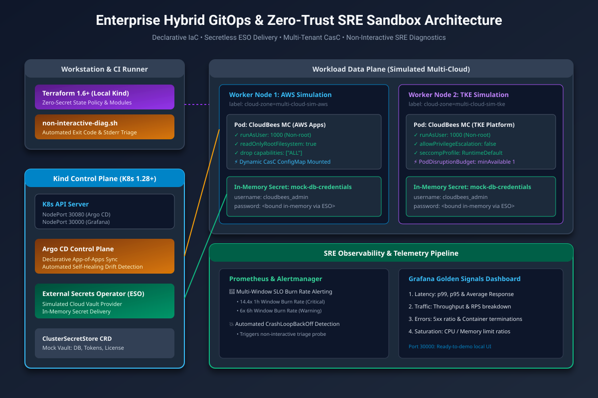

# Enterprise Hybrid GitOps & Zero-Trust SRE Sandbox

[](https://kubernetes.io/)
[](https://www.terraform.io/)
[](https://argoproj.github.io/cd/)
[](https://external-secrets.io/)
[](https://prometheus.io/)
[](https://opensource.org/licenses/Apache-2.0)

> **Companion Architecture Blueprint**: See the companion in-depth technical retrospective and whitepaper at [multicloud-cicd-zero-trust-architecture](https://github.com/GRayMillerDes/multicloud-cicd-zero-trust-architecture).

A production-mirror local sandbox demonstrating modern platform engineering practices in regulated environments. This repository implements declarative infrastructure provisioning, secretless workload identities, automated drift detection, and non-interactive SRE diagnostic workflows.

---

## 🏗️ Architecture Overview

The lab simulates a hybrid multi-cluster environment with an emphasis on **Zero-ClickOps compliance** and **Zero-Trust credential delivery**:

```mermaid
graph TB
    %% Styling and Class Definitions
    classDef client fill:#1e293b,stroke:#38bdf8,stroke-width:2px,color:#f8fafc;
    classDef control fill:#1e1b4b,stroke:#818cf8,stroke-width:2px,color:#f8fafc;
    classDef aws fill:#451a03,stroke:#fbbf24,stroke-width:2px,color:#fef3c7;
    classDef tke fill:#14532d,stroke:#34d399,stroke-width:2px,color:#ecfdf5;
    classDef obs fill:#701a75,stroke:#f472b6,stroke-width:2px,color:#fdf2f8;
    classDef secret fill:#022c22,stroke:#10b981,stroke-width:2px,color:#d1fae5;

    subgraph WORKSTATION["💻 Local Workstation / CI Runner"]
        TF["🏗️ Terraform 1.6+<br/>• Kind Multi-Node Engine<br/>• Zero-Secret State Providers"]:::client
        DIAG["🩺 SRE Diagnostic Script<br/>• non-interactive-diag.sh<br/>• Exit Code & Stderr Triage"]:::client
    end

    subgraph CONTROL_PLANE["☸️ Local Kind Control Plane (v1.28+)"]
        API["🚪 Kubernetes API Server<br/>NodePort 30080 / 30000"]:::control
        ARGO["🐙 Argo CD GitOps<br/>• App-of-Apps Pattern<br/>• Automated Drift Self-Healing"]:::control
        ESO["🔐 External Secrets Operator<br/>• ClusterSecretStore CRD<br/>• ExternalSecret Reconciliation"]:::secret
        MOCK_STORE[("☁️ Simulated Cloud Vault<br/>AWS SSM / Vault Secret Provider")]:::secret
    end

    subgraph DATA_PLANE["⚡ Workload Data Plane (Simulated Multi-Cloud)"]
        subgraph NODE_AWS["🟠 Worker 1: AWS Simulation Node"]
            MC_AWS["🐝 CloudBees MC - AWS Apps<br/>• runAsUser: 1000<br/>• Read-only Root FS<br/>• Dynamic CasC Injection"]:::aws
            SECRET_AWS[("🔑 K8s Secret (In-Memory)<br/>mock-db-credentials")]:::secret
        end

        subgraph NODE_TKE["🟢 Worker 2: TKE Simulation Node"]
            MC_TKE["🐝 CloudBees MC - TKE Platform<br/>• CIS Benchmark Hardened<br/>• Drop ALL Linux Caps"]:::tke
            SECRET_TKE[("🔑 K8s Secret (In-Memory)<br/>mock-db-credentials")]:::secret
        end
    end

    subgraph OBSERVABILITY["📊 Enterprise SRE Observability Stack"]
        PROM["🔥 Prometheus Core<br/>• SLO Burn Rate Multi-Window<br/>• CrashLoopBackOff Detection"]:::obs
        GRAF["📈 Grafana Dashboards<br/>• Golden Signals (Latency, Traffic, Errors, Saturation)"]:::obs
    end

    %% Workflows & Data Flows
    TF ==>|1. Declarative Bootstrap| API
    ARGO -->|2. GitOps Continuous Delivery| MC_AWS
    ARGO -->|2. GitOps Continuous Delivery| MC_TKE
    ESO <-->|3. Zero-Trust Fetch| MOCK_STORE
    ESO -.->|4. Inject Ephemeral Secret| SECRET_AWS
    ESO -.->|4. Inject Ephemeral Secret| SECRET_TKE
    SECRET_AWS -->|5. Mount Vault Env| MC_AWS
    SECRET_TKE -->|5. Mount Vault Env| MC_TKE

    PROM -.->|6. Scrape 15s Cadence| MC_AWS
    PROM -.->|6. Scrape 15s Cadence| MC_TKE
    GRAF -->|7. PromQL Metrics Queries| PROM
    DIAG -.->|8. Automated Non-Interactive Triage| MC_AWS
    DIAG -.->|8. Automated Non-Interactive Triage| MC_TKE
```





1. **Declarative Control Plane**: Automated local Kind multi-node cluster deployment via Terraform.
2. **Zero-Trust Secret Governance**: Implements [External Secrets Operator (ESO)](https://external-secrets.io/) fetching mock parameters from cloud secret stores, completely eliminating credentials from Terraform state and Git repositories.
3. **Declarative GitOps Delivery**: Argo CD synchronizing multi-tenant controller instances with standardized security contexts (`runAsUser: 1000`, read-only root filesystems).
4. **Non-Interactive Diagnostic Hooks**: Automated log extraction pipelines designed for environments where direct `kubectl exec/logs` cluster access is restricted by enterprise least-privilege policies.
5. **SRE Telemetry**: Pre-configured Prometheus alerts targeting Golden Signals (Traffic, Errors, Latency, Saturation) and Grafana dashboards for cluster-wide health.

---

## 📂 Repository Clean Architecture

```text
hybrid-gitops-sre-lab/
├── README.md                      # Comprehensive Architecture & Operations Runbook
├── architecture/
│   ├── ARCHITECTURE.md            # Control Plane vs Data Plane Technical Blueprint
│   ├── topology-diagram.png       # High-Resolution Architectural Topology
│   └── topology-diagram.mermaid   # Mermaid Source Graph
├── terraform/                     # Multi-Node Sandbox Infrastructure as Code
│   ├── modules/
│   │   ├── kind-cluster/          # Local Kind Cluster (1 Control-Plane + 2 Workers)
│   │   ├── eso-secret-store/      # External Secrets Operator Mock Cloud Store
│   │   └── observability-stack/   # Automated Prometheus & Grafana Injection
│   ├── main.tf                    # Root Module Orchestration
│   ├── variables.tf
│   ├── outputs.tf
│   └── terraform.tfvars.example
├── gitops/                        # Argo CD Declarative Manifests & Helm Charts
│   ├── apps/
│   │   ├── root-application.yaml  # Argo CD App-of-Apps Entrypoint
│   │   └── managed-controllers.yaml # Multi-Tenant Controller Topology
│   └── charts/
│       └── cloudbees-mc-template/ # Hardened CasC Controller Template
├── observability/
│   ├── dashboards/
│   │   └── golden-signals.json    # Grafana Golden Signals Dashboard (Latency, Traffic, Errors, Saturation)
│   └── alert-rules/
│       ├── slo-burn-rate.yaml     # SRE SLO Multi-Window Burn Rate Alerts
│       └── pod-crashloop.yaml     # Pod CrashLoopBackOff & Termination Diagnostic Alerts
└── scripts/
    ├── setup-local-env.sh         # One-Command Local Environment Bootstrap
    └── non-interactive-diag.sh    # Non-Interactive Container Exit Code & Stderr Triage Tool
```

---

## 🚀 Quickstart

### Prerequisites
- [Docker Engine](https://docs.docker.com/engine/) 24.0+
- [Kind](https://kind.sigs.k8s.io/) & [kubectl](https://kubernetes.io/docs/tasks/tools/)
- [Terraform](https://www.terraform.io/) 1.6+
- [Helm](https://helm.sh/) 3.12+

### 1. Provision Infrastructure & Platform

Option A: Automated bootstrap via script:
```bash
./scripts/setup-local-env.sh
```

Option B: Manual Terraform execution:
```bash
cd terraform
cp terraform.tfvars.example terraform.tfvars
terraform init
terraform apply -auto-approve
```

Access local endpoints once applied:
- **Argo CD UI**: [http://localhost:30080](http://localhost:30080)
- **Grafana Golden Signals**: [http://localhost:30000](http://localhost:30000) (User: `admin`, Password: `prom-operator`)

---

### 2. Verify Zero-Trust Secret Synchronization

Verify that no plaintext secrets exist in Terraform state while credentials are synthesized dynamically in-memory by ESO:

```bash
# Verify ClusterSecretStore status
kubectl get clustersecretstore

# Verify ExternalSecret reconciliation
kubectl get externalsecrets -A

# Inspect in-memory generated Kubernetes secret
kubectl get secret mock-db-credentials -n default -o yaml
```

---

### 3. Run Non-Interactive Diagnostic Probe

Simulate a failed deployment under least-privilege restrictions (without granting `kubectl exec` permissions to operators):

```bash
# Run automated triage targeting failed or restarting pods
./scripts/non-interactive-diag.sh --namespace default --pod-label app=broken-worker
```

The script inspects `.status.containerStatuses`, pinpoints the container's `terminated.exitCode`, and pulls the `--previous` stderr log buffer to diagnose root cause instantly:
```text
==============================================================================
 [SRE Proactive RCA] Non-Interactive Diagnostic Probe
 Target Namespace : default
 Target Selector  : app=broken-worker
==============================================================================
[*] Inspecting Pod: broken-worker-7c98b64f4f-2xjlw
    Phase: Running | Cumulative Restarts: 4
    [*] Container: worker
        State/Waiting Reason : CrashLoopBackOff
        Last Exit Code       : 137 (OOMKilled) / 1 (Application Error)
        Extracting previous log buffer...
        [+] Previous logs extracted -> /tmp/sre-diagnostics-xxx/broken-worker_worker_previous.log
==============================================================================
[+] Diagnostic scan complete without requiring interactive shell access.
```

---

## 🛡️ Key SRE & Security Features

- 🔒 **Zero-Secret Terraform State**: All sensitive values are decoupled from IaC and injected dynamically via ESO CRDs at runtime.
- 🛡️ **Hardened Security Contexts**: Enforces CIS Kubernetes benchmarks (`allowPrivilegeEscalation: false`, `readOnlyRootFilesystem: true`, drop `ALL` capabilities, non-root user `1000`).
- ⚡ **Automated Drift Self-Healing**: Argo CD reconciles cluster state automatically, preventing configuration drift caused by manual web console operations.
- 📊 **SRE Golden Signals Telemetry**: Continuous monitoring of Latency, Traffic, Errors, and Saturation, paired with multi-window SLO burn rate alerts based on Google SRE standards.
- 🔍 **Automated Failure Triage**: Eliminates troubleshooting dead-ends in production namespaces where engineers are prohibited from interactive shell execution.

---

## 📄 License

Distributed under the Apache-2.0 License. See [LICENSE](./LICENSE) for more details.
