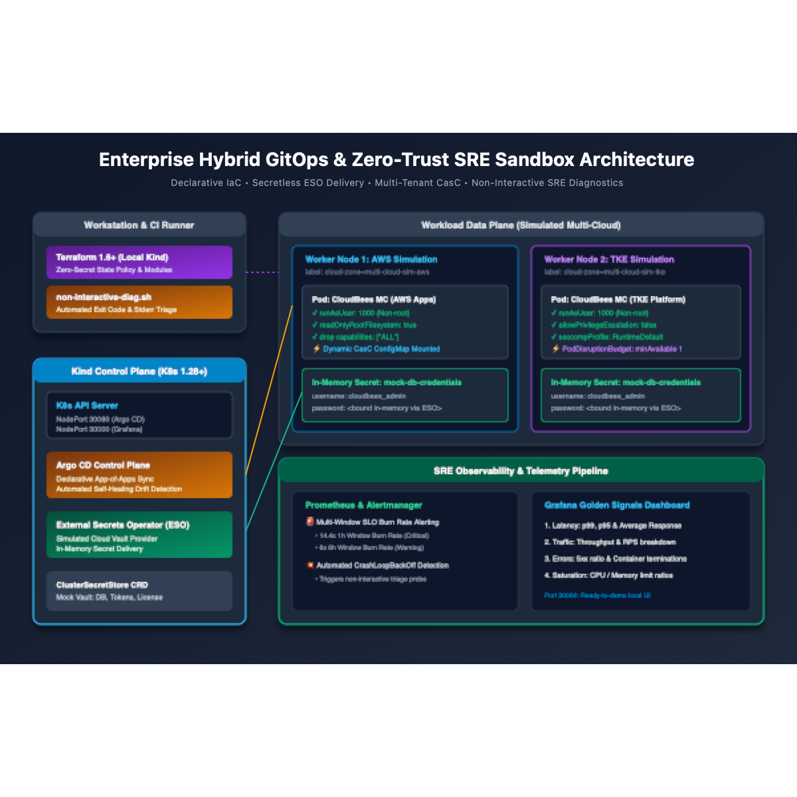
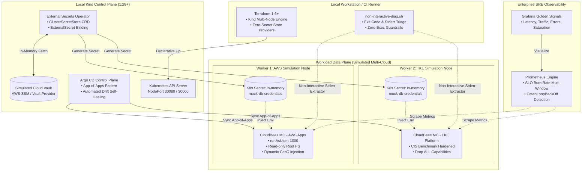

# Architecture Deep Dive & Zero-Trust Governance

This document describes the architectural design, security boundaries, and telemetry foundations implemented in the **Enterprise Hybrid GitOps & SRE Sandbox**.

---

## 1. Design Principles

1. **Zero Plaintext State (Least-Privilege State Delivery)**:
   - Credentials must never be declared in `values = [yamlencode(...)]` within Terraform or Helm code.
   - Terraform manages declarative infrastructure definitions and Custom Resource Definitions (CRDs). Runtime secrets are delegated dynamically to [External Secrets Operator (ESO)](https://external-secrets.io/).

2. **Zero-ClickOps & Drift Self-Healing**:
   - Applications are synchronized using Argo CD's **App-of-Apps** pattern.
   - Any manual modifications (`kubectl edit`, console drift) trigger automated out-of-sync notifications and self-healing reconciliation.

3. **Restricted Workload Privileges (CIS Benchmark Compliance)**:
   - All managed controller workloads enforce:
     - `runAsUser: 1000` (strictly non-root execution)
     - `readOnlyRootFilesystem: true`
     - `allowPrivilegeEscalation: false`
     - `capabilities.drop: ["ALL"]`
     - `seccompProfile.type: RuntimeDefault`

4. **Non-Interactive Diagnostic Hooks**:
   - In financial and high-security compliance zones, platform engineers are prohibited from running `kubectl exec`, `kubectl attach`, or `kubectl port-forward` inside production namespaces.
   - Root-cause analysis (RCA) must rely on non-interactive automated log extraction pipelines targeting `.status.containerStatuses` and `--previous` stderr streams.

---

## 2. Component Topology

| Component | Layer | Responsibilities | Security Context |
| :--- | :--- | :--- | :--- |
| **Kind Cluster** | Infrastructure | Simulates multi-node heterogeneous multi-cloud topology (AWS & TKE zones) | Node labels, Ingress & NodePort bindings |
| **Terraform 1.6+** | Platform Orchestration | Declarative cluster bootstrap, Helm provider glue, zero-secret state enforcement | Automated execution via TF Cloud / local runners |
| **Argo CD** | GitOps Delivery | App-of-Apps management, drift detection, continuous synchronization | Insecure mode for local sandbox demo |
| **External Secrets Operator** | Secret Fabric | Synchronizes secrets from simulated cloud providers directly into in-memory K8s Secret resources | Scoped ClusterSecretStore |
| **CloudBees MC Template** | Workload Data Plane | Emulates multi-tenant build controllers with dynamic CasC configurations | CIS-hardened, non-root, read-only root FS |
| **Prometheus / Alertmanager** | Observability | Scrapes cluster metrics, evaluates multi-window SLO burn rates, detects CrashLoopBackOff | Monitoring namespace isolation |
| **Grafana** | Visualization | Golden Signals dashboards (Latency, Traffic, Errors, Saturation) | NodePort 30000 |

---

## 3. High-Resolution Architecture Topology

