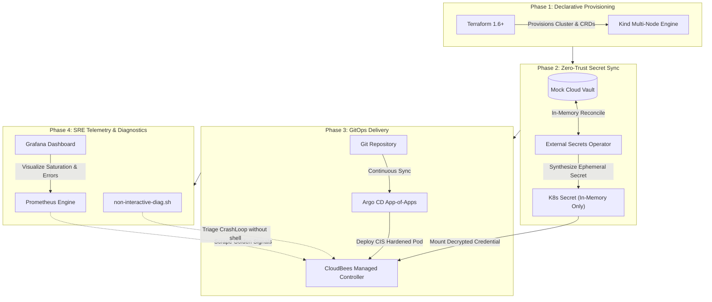

# Architecture Deep Dive & Zero-Trust Governance

This document provides a clear, progressive breakdown of the architectural design, security boundaries, and telemetry mechanisms in the **Enterprise Hybrid GitOps & SRE Sandbox**.

---

## 1. Executive Summary: What Problem Does This Solve?

In enterprise and regulated cloud-native environments (such as Fintech, Gaming, and Healthcare), platform teams face three critical challenges:
1. **The Credential Leak Dilemma**: Traditional Terraform setups pass passwords and tokens directly into Helm values, accidentally committing plaintext credentials into `terraform.tfstate`.
2. **The "No-kubectl" Compliance Wall**: ISO 27001 and PCI-DSS compliance prohibit human operators from running interactive shell commands (`kubectl exec`) in production, creating troubleshooting bottlenecks.
3. **Configuration Drift**: Manual hotfixes made directly in cloud consoles or cluster objects cause configuration divergence between code and live environments.

This sandbox demonstrates how to solve all three problems locally with a zero-cost Kind cluster using enterprise-grade GitOps, External Secrets Operator (ESO), and automated SRE telemetry.

---

## 2. End-to-End Operational Lifecycle

The diagram below illustrates how code transitions from a pull request into live, self-healing production workloads:

---

## 3. Core Architectural Layers Explained

### Layer 1: Infrastructure & Orchestration (Terraform & Kind)
* **What it does**: Terraform bootstraps a local 3-node Kubernetes cluster simulating a multi-cloud topology (1 Control Plane node, 1 AWS-labeled worker, 1 TKE-labeled worker).
* **Key Security Feature**: Zero credentials in state. Terraform only installs operators and CRDs; it never handles database passwords or API keys.

### Layer 2: Secret Delivery Fabric (External Secrets Operator)
* **What it does**: Instead of hardcoding passwords in Git or Terraform, ESO acts as an in-cluster bridge that synchronizes credentials from an external vault provider.
* **How it works**:
  1. An `ExternalSecret` manifest declares *what* key is needed from the vault.
  2. The ESO controller fetches the secret and generates a standard Kubernetes `Secret` inside the cluster's etcd memory.
  3. The workload mounts the secret as an environment variable or volume file.

### Layer 3: Continuous Delivery (Argo CD GitOps)
* **What it does**: Manages multi-tenant application workloads using the **App-of-Apps** pattern.
* **Self-Healing Guarantee**: If an operator manually modifies or deletes a pod configuration with `kubectl`, Argo CD detects the divergence and automatically rolls it back to the exact state committed in Git within seconds.

### Layer 4: SRE Observability & Non-Interactive Diagnostics
* **What it does**: Implements the Google SRE "Four Golden Signals" (Latency, Traffic, Errors, and Saturation).
* **The Diagnostic Innovation**: When a pod enters `CrashLoopBackOff`, engineers do not need `kubectl exec` shell permissions. The `./scripts/non-interactive-diag.sh` tool inspects `.status.containerStatuses`, pinpoints the container's exit code (e.g., 137 for OOMKilled, 1 for JVM configuration panic), and captures previous stderr logs automatically.

---

## 4. Workload Security Hardening Matrix

All deployed application workloads conform strictly to the CIS Kubernetes Benchmark:

| Security Constraint | Implementation in Manifest | Threat Prevented |
| :--- | :--- | :--- |
| **Non-Root Execution** | `runAsNonRoot: true`, `runAsUser: 1000` | Prevents container breakout gaining root control over node |
| **Immutable Filesystem** | `readOnlyRootFilesystem: true` | Prevents malware or unauthorized scripts from writing to disk |
| **Privilege Escalation** | `allowPrivilegeEscalation: false` | Blocks `setuid` binaries from elevating process permissions |
| **Linux Capabilities** | `capabilities.drop: ["ALL"]` | Strips all kernel privileges not strictly required |
| **Seccomp Sandboxing** | `seccompProfile.type: RuntimeDefault` | Restricts dangerous system calls to kernel |

---

## 5. Architectural Topology Reference

```mermaid
graph TB
    classDef client fill:#1e293b,stroke:#38bdf8,stroke-width:2px,color:#f8fafc;
    classDef control fill:#1e1b4b,stroke:#818cf8,stroke-width:2px,color:#f8fafc;
    classDef aws fill:#451a03,stroke:#fbbf24,stroke-width:2px,color:#fef3c7;
    classDef tke fill:#14532d,stroke:#34d399,stroke-width:2px,color:#ecfdf5;
    classDef obs fill:#701a75,stroke:#f472b6,stroke-width:2px,color:#fdf2f8;
    classDef secret fill:#022c22,stroke:#10b981,stroke-width:2px,color:#d1fae5;

    subgraph WORKSTATION["Local Workstation / CI Runner"]
        TF["Terraform 1.6+<br/>• Kind Multi-Node Engine<br/>• Zero-Secret State Providers"]:::client
        DIAG["SRE Diagnostic Script<br/>• non-interactive-diag.sh<br/>• Exit Code & Stderr Triage"]:::client
    end

    subgraph CONTROL_PLANE["Local Kind Control Plane (v1.28+)"]
        API["Kubernetes API Server<br/>NodePort 30080 / 30000"]:::control
        ARGO["Argo CD GitOps<br/>• App-of-Apps Pattern<br/>• Automated Drift Self-Healing"]:::control
        ESO["External Secrets Operator<br/>• ClusterSecretStore CRD<br/>• ExternalSecret Reconciliation"]:::secret
        MOCK_STORE[("Simulated Cloud Vault<br/>AWS SSM / Vault Secret Provider")]:::secret
    end

    subgraph DATA_PLANE["Workload Data Plane (Simulated Multi-Cloud)"]
        subgraph NODE_AWS["Worker 1: AWS Simulation Node"]
            MC_AWS["CloudBees MC - AWS Apps<br/>• runAsUser: 1000<br/>• Read-only Root FS<br/>• Dynamic CasC Injection"]:::aws
            SECRET_AWS[("K8s Secret (In-Memory)<br/>mock-db-credentials")]:::secret
        end

        subgraph NODE_TKE["Worker 2: TKE Simulation Node"]
            MC_TKE["CloudBees MC - TKE Platform<br/>• CIS Benchmark Hardened<br/>• Drop ALL Linux Caps"]:::tke
            SECRET_TKE[("K8s Secret (In-Memory)<br/>mock-db-credentials")]:::secret
        end
    end

    subgraph OBSERVABILITY["Enterprise SRE Observability Stack"]
        PROM["Prometheus Core<br/>• SLO Burn Rate Multi-Window<br/>• CrashLoopBackOff Detection"]:::obs
        GRAF["Grafana Dashboards<br/>• Golden Signals (Latency, Traffic, Errors, Saturation)"]:::obs
    end

    TF ==>|1. Declarative Bootstrap| API
    ARGO -->|2. GitOps Continuous Delivery| MC_AWS
    ARGO -->|2. GitOps Continuous Delivery| MC_TKE
    ESO <-->|3. Zero-Trust Fetch| MOCK_STORE
    ESO -.->|4. Inject Ephemeral Secret| SECRET_AWS
    ESO -.->|4. Inject Ephemeral Secret| SECRET_TKE
    SECRET_AWS -->|5. Mount Vault Env| MC_AWS
    SECRET_TKE -->|5. Mount Vault Env| MC_TKE

    PROM -.->|6. Scrape 15s Cadence| MC_AWS
    PROM -.->|6. Scrape 15s Cadence| MC_TKE
    GRAF -->|7. PromQL Metrics Queries| PROM
    DIAG -.->|8. Automated Non-Interactive Triage| MC_AWS
    DIAG -.->|8. Automated Non-Interactive Triage| MC_TKE
```

